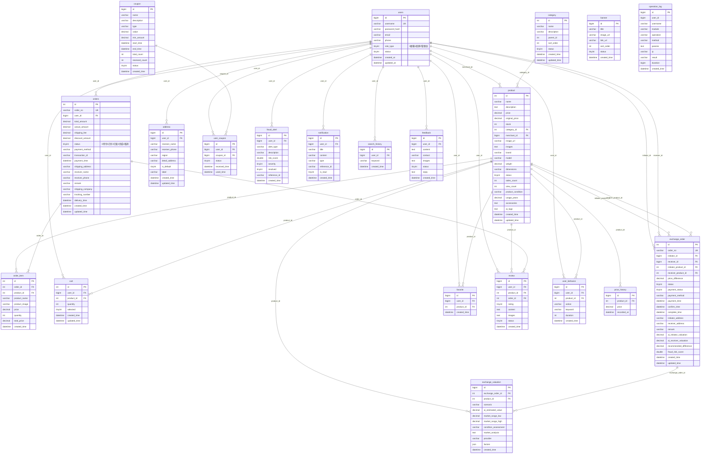

# 系统 ER 图

```mermaid
erDiagram
    users {
        bigint id PK
        varchar username UK
        varchar password_hash
        varchar email
        varchar phone
        tinyint role_type "0顾客1商家2管理员"
        tinyint status
        datetime created_at
        datetime updated_at
    }

    category {
        int id PK
        varchar name
        varchar description
        int parent_id
        int sort_order
        tinyint status
        datetime created_time
        datetime updated_time
    }

    product {
        int id PK
        varchar name
        text description
        decimal price
        decimal original_price
        int stock
        int category_id FK
        bigint merchant_id FK
        varchar image_url
        text images
        varchar brand
        varchar model
        decimal weight
        varchar dimensions
        tinyint status
        int sales_count
        int view_count
        varchar product_condition
        decimal usage_years
        text accessories
        text ai_tags
        datetime created_time
        datetime updated_time
    }

    orders {
        int id PK
        varchar order_no UK
        bigint user_id FK
        decimal total_amount
        decimal actual_amount
        decimal shipping_fee
        decimal discount_amount
        tinyint status "0待付1已付2已发3完成4取消"
        varchar payment_method
        varchar transaction_id
        datetime payment_time
        varchar shipping_address
        varchar receiver_name
        varchar receiver_phone
        varchar remark
        varchar shipping_company
        varchar tracking_number
        datetime delivery_time
        datetime created_time
        datetime updated_time
    }

    order_item {
        int id PK
        int order_id FK
        int product_id FK
        varchar product_name
        varchar product_image
        decimal price
        int quantity
        decimal total_price
        datetime created_time
    }

    cart {
        int id PK
        bigint user_id FK
        int product_id FK
        int quantity
        tinyint selected
        datetime created_time
        datetime updated_time
    }

    exchange_order {
        int id PK
        varchar order_no UK
        bigint initiator_id FK
        bigint receiver_id FK
        int initiator_product_id FK
        int receiver_product_id FK
        decimal price_difference
        tinyint status
        tinyint payment_status
        varchar payment_method
        datetime payment_time
        datetime confirm_time
        datetime complete_time
        varchar initiator_address
        varchar receiver_address
        varchar remark
        decimal ai_initiator_valuation
        decimal ai_receiver_valuation
        decimal recommended_difference
        double fraud_risk_score
        datetime created_time
        datetime updated_time
    }

    exchange_valuation {
        bigint id PK
        int exchange_order_id FK
        int product_id FK
        varchar scenario
        decimal ai_estimated_value
        decimal market_range_low
        decimal market_range_high
        varchar condition_assessment
        text market_analysis
        varchar provider
        json factors
        datetime created_time
    }

    address {
        bigint id PK
        bigint user_id FK
        varchar receiver_name
        varchar receiver_phone
        varchar region
        varchar detail_address
        tinyint is_default
        varchar label
        datetime created_time
        datetime updated_time
    }

    coupon {
        bigint id PK
        varchar name
        varchar description
        varchar type
        decimal value
        decimal min_amount
        datetime start_time
        datetime end_time
        int total_count
        int received_count
        tinyint status
        datetime created_time
    }

    user_coupon {
        bigint id PK
        bigint user_id FK
        bigint coupon_id FK
        tinyint status
        datetime received_time
        datetime used_time
    }

    favorite {
        bigint id PK
        bigint user_id FK
        int product_id FK
        datetime created_time
    }

    review {
        bigint id PK
        bigint user_id FK
        int product_id FK
        int order_id FK
        tinyint rating
        text content
        text images
        tinyint status
        datetime created_time
    }

    user_behavior {
        bigint id PK
        bigint user_id FK
        int product_id FK
        varchar action
        varchar keyword
        int duration
        datetime created_time
    }

    price_history {
        bigint id PK
        int product_id FK
        decimal price
        datetime recorded_at
    }

    fraud_alert {
        bigint id PK
        bigint user_id FK
        varchar alert_type
        varchar description
        double risk_score
        tinyint severity
        tinyint resolved
        varchar reference_id
        datetime created_time
    }

    notification {
        bigint id PK
        bigint user_id FK
        varchar title
        varchar content
        varchar type
        varchar reference_id
        tinyint is_read
        datetime created_time
    }

    search_history {
        bigint id PK
        bigint user_id FK
        varchar keyword
        datetime created_time
    }

    feedback {
        bigint id PK
        bigint user_id FK
        text content
        varchar contact
        text images
        tinyint status
        text reply
        datetime created_time
    }

    banner {
        bigint id PK
        varchar title
        varchar image_url
        varchar link_url
        int sort_order
        tinyint status
        datetime created_time
    }

    operation_log {
        bigint id PK
        bigint user_id
        varchar username
        varchar module
        varchar operation
        varchar method
        text params
        varchar ip
        varchar result
        bigint duration
        datetime created_time
    }

    %% ===== 关系 =====

    users ||--o{ product : "merchant_id"
    users ||--o{ orders : "user_id"
    users ||--o{ cart : "user_id"
    users ||--o{ address : "user_id"
    users ||--o{ favorite : "user_id"
    users ||--o{ review : "user_id"
    users ||--o{ user_behavior : "user_id"
    users ||--o{ notification : "user_id"
    users ||--o{ search_history : "user_id"
    users ||--o{ feedback : "user_id"
    users ||--o{ user_coupon : "user_id"
    users ||--o{ fraud_alert : "user_id"
    users ||--o{ exchange_order : "initiator_id"
    users ||--o{ exchange_order : "receiver_id"

    category ||--o{ product : "category_id"

    product ||--o{ cart : "product_id"
    product ||--o{ order_item : "product_id"
    product ||--o{ favorite : "product_id"
    product ||--o{ review : "product_id"
    product ||--o{ user_behavior : "product_id"
    product ||--o{ price_history : "product_id"
    product ||--o{ exchange_order : "initiator_product_id"
    product ||--o{ exchange_order : "receiver_product_id"
    product ||--o{ exchange_valuation : "product_id"

    orders ||--|{ order_item : "order_id"
    orders ||--o{ review : "order_id"

    exchange_order ||--o{ exchange_valuation : "exchange_order_id"

    coupon ||--o{ user_coupon : "coupon_id"
```
